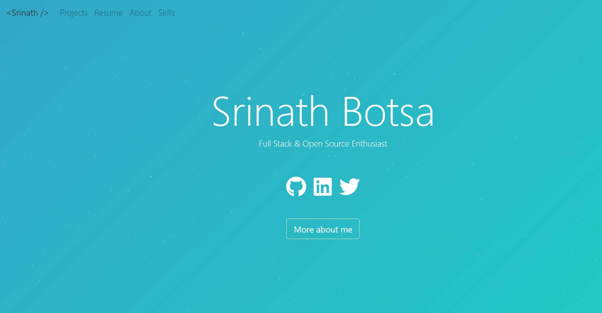

<p align="center">
  <h1 align="center">Srinath Botsa's Portfolio</h1>
  <p align="center">
    The personal portfolio of Srinath Botsa is built using React, Bootstrap and hosted with GitHub Pages . Demo: 
    <a href="https://bsrinath9.github.io/">bsrinath9.github.io</a>
    <br />
  </p>
</p>

<!--Demo image -->

[](https://bsrinath9.github.io/)

## Technology Stack 

Dependencies defined in package.json:

[Reactjs](https://reactjs.org/)
| [Bootstrap](https://getbootstrap.com/)
| [Typist](https://github.com/jstejada/react-typist)
| [GitHub API](https://developer.github.com/v3/repos/)
| [Instagram API](https://www.instagram.com/developer/embedding/)

## Sharing 

Project is open source, and was based on work by @hashirshoaeb that can be found [here](https://github.com/hashirshoaeb/home).

## Prerequisites 

- You should have [Node.js](https://nodejs.org/en/) and [Git](https://git-scm.com/) installed on your PC. 
- You should also own a GitHub account.

## Setup And Deployment

1. To Get Started, Fork this repository to your GitHub account:
2. Clone the forked repo from your account using:

   ```bash
     git clone https://github.com/<your-username>/home.git
   ```

3. Open in editor and edit [src/editable-stuff/config.js](./src/editable-stuff/config.js) file.

4. Add your resume as <resume.pdf> in place of [src/editable-stuff/resume.pdf](./src/editable-stuff/)
5. Change URL in [package.json](./package.json) file:

   ```json
   "homepage": "https://<your-username>.github.io/home"
   ```

   Or for custom deployment, refer [create-react-app.dev](https://create-react-app.dev/docs/deployment/)

6. Edit [title](./public/index.html#L34) and meta [description](./public/index.html#L13) in [public/index.html](./public/index.html).

7. After editing run the following bash commands:

   ```bash
   npm install
   npm start
   ```
   
   7.1. If you get any error like this "Error: ENOENT: no such file or directory, scandir 'C:\xxx\home\node_modules\node-sass\vendor' " after running  ```npm start```
        try this ```npm rebuild node-sass ```

8. To deploy website run:

   ```bash
    npm run deploy
   ```

   For custom deployment, refer [pages.js](./pages.js)

   ```bash
    npm run custom-deploy
   ```

9. Congrats your site is up and running. To see it live, visit:

   ```https
     https://<your-username>.github.io/home
   ```

## License

[LGPL-3.0](https://www.gnu.org/licenses/lgpl-3.0.en.html)
